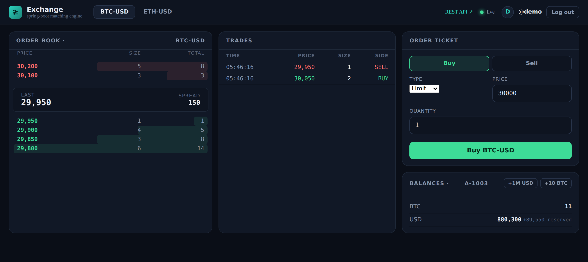
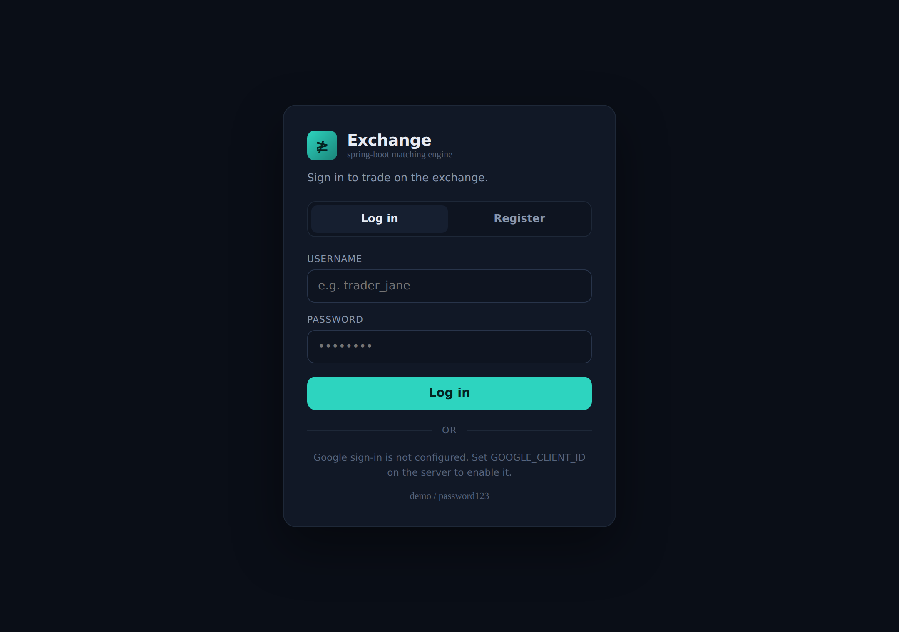

# Trading Exchange Backend

A concurrent spot trading exchange built with **Java 26 + Spring Boot 4**. It has a
thread-safe price-time-priority **matching engine**, full **account and balance
management** with fund reservation and atomic settlement, **stateless JWT
authentication** (username/password and Google sign-in) with Spring Security, and a
**REST + WebSocket API** with OpenAPI docs and a live trading dashboard.

The headline engineering property is **conservation of value**: matching only ever
*transfers* assets between accounts, never creates or destroys them. This invariant
is enforced by the settlement logic and verified by a concurrency test that fires
8,000 orders across 8 threads and asserts the total quantity of every asset is
exactly unchanged.



Users authenticate on a login/register screen before trading; each account acts only
on its own funds, enforced from the bearer token rather than the request body.



---

## Why this project

Enterprise finance runs on the JVM. This backend is designed to exercise the
skills those teams probe in interviews: correct concurrent state management,
careful money handling, clean layered architecture, REST/WebSocket API design,
and a test suite that proves the hard invariants rather than just the happy path.

It is a deliberately self-contained, in-memory system — a faithful model of the
core mechanics of an exchange, not a production venue. The honesty notes at the
bottom spell out exactly where the simplifications are and how each would be
hardened.

---

## Architecture

A standard layered Spring Boot application. The domain and engine are plain Java
with no framework coupling, which keeps them fast to test in isolation.

```
web/          REST controllers, WebSocket handler, global exception handler
  │
service/      ExchangeService (orchestration, locking, settlement), AccountService
  │
engine/       MatchingEngine — pure price-time matching, returns Fills
  │
domain/       Order, Trade, OrderBook, Account, Instrument, enums
  │
repository/   in-memory stores (ConcurrentHashMap) behind simple interfaces
```

Requests flow in through a controller, are validated, and hit `ExchangeService`,
which reserves funds, calls the `MatchingEngine`, settles each resulting fill
atomically against the two accounts, records trades, and publishes a live update
to WebSocket subscribers.

---

## The matching engine

Each instrument has one `OrderBook`. Each side of the book is a price-sorted map
of FIFO queues:

- **Bids** sorted descending (best = highest price), **asks** ascending (best =
  lowest price).
- Within a price level, orders are a FIFO queue, so earlier orders match first.

This gives **price-time priority** — better prices match first, ties broken by
arrival order — with `O(log L)` access to the best level in the number of price
levels `L`.

A taker order walks the opposite side from the best price, producing fills until
it is filled or the book stops crossing:

- Trades always print at the **resting maker's price** (the maker set the price by
  resting first).
- A **LIMIT** order that is not fully filled **rests** in the book.
- A **MARKET** order never rests; any unfilled remainder is **cancelled**.
- A **MARKET BUY** is capped by a quote budget, because its cost is unknown until
  it executes — this guarantees every fill is affordable.

---

## Accounts, reservation and atomic settlement

Every account holds, per asset, an **available** balance (spendable) and a
**reserved** balance (held against open orders). Placing an order reserves the
funds it might spend so they can't be double-spent by another order:

| Order | Reserves |
|-------|----------|
| Limit buy  | `quantity × price` of the **quote** asset |
| Limit sell | `quantity` of the **base** asset |
| Market sell| `quantity` of the **base** asset |
| Market buy | nothing up front; capped by available quote as a budget |

Each fill then settles atomically:

- **Seller** spends reserved base, receives quote.
- **Buyer** spends quote (from reserved if it was a limit order, from available if
  a budgeted market buy) and receives base.
- A **limit buy that executes below its limit** has the difference refunded from
  reserved back to available — so a buyer who bids 100 but trades at 90 keeps the
  10 difference.

Because every trade is a pure transfer between two accounts, the sum of each
asset across all accounts (available + reserved) is invariant under trading.

### Money is always integer

All prices and quantities are `long` integers in the asset's smallest tradable
unit, so `notional = price × quantity` is exact. There is no `double` anywhere in
the money path — floating-point currency bugs are a classic and unacceptable class
of error in an exchange.

---

## Concurrency model

- All activity on a given instrument is serialised under a **per-symbol
  `ReentrantLock`**, so matching and settlement for one book behave as if
  single-threaded, while **different symbols run fully in parallel**.
- Account balance mutations are **atomic per account** (`synchronized`), so there
  are no lost updates when one account trades on multiple symbols at once.
- The service **never holds two account locks simultaneously**, so there is no
  possibility of a lock-ordering deadlock.

The `ConcurrencyTest` exercises this directly: 8 threads each place 1,000 random
orders against a shared book, after which the test asserts total USD and total BTC
are unchanged to the unit, no balance is negative, and the run did not deadlock.

---

## Authentication & authorization

Auth is stateless, built on **Spring Security** and **JWT**. There are two ways in:

- **Username / password** — register creates a user, hashes the password with
  **BCrypt**, provisions a fresh trading account, and returns a signed token.
  Login verifies the hash and returns a token.
- **Google sign-in** — the browser gets a Google **ID token** via Google Identity
  Services and posts it to the server, which verifies the token's signature against
  Google's public JWKS and checks the issuer and audience before issuing its own
  token. On first sign-in a matching account is provisioned automatically.

Tokens are **HMAC-SHA256 JWTs** carrying the username and the linked `accountId`,
minted with Spring Security's `JwtEncoder` and validated by the OAuth2 resource
server on every protected request. Two authorization details worth calling out:

- **The account is taken from the token, never the request body** — a user can only
  ever place or cancel orders on their own account.
- Reading another user's account or order returns **404**, so the API never
  confirms the existence of resources you don't own.

Market-data reads (`/api/market/**`), the WebSocket feed, the docs and the login
page are public; everything else requires a bearer token.

To enable Google sign-in, set `GOOGLE_CLIENT_ID` to your OAuth 2.0 Web client id
(from the Google Cloud console) and add `http://localhost:8080` as an authorized
JavaScript origin. Left unset, the app runs fine with username/password only and the
UI shows Google as unavailable.

---

## API

REST base path `/api`. Interactive OpenAPI docs at **`/swagger-ui.html`**.
🔒 = requires a bearer token.

| Method | Path | Description |
|--------|------|-------------|
| `GET`  | `/api/auth/config` | Whether Google sign-in is enabled |
| `POST` | `/api/auth/register` | Create a user (returns a token + accountId) |
| `POST` | `/api/auth/login` | Log in with username/password |
| `POST` | `/api/auth/google` | Log in with a Google ID token |
| `GET`  | `/api/auth/me` 🔒 | Current user + balances |
| `POST` | `/api/orders` 🔒 | Place an order on your account (returns order + trades) |
| `GET`  | `/api/orders/{id}` 🔒 | Order status (owner only) |
| `DELETE` | `/api/orders/{id}` 🔒 | Cancel an order (owner only; releases reserved funds) |
| `GET`  | `/api/accounts/{id}` 🔒 | Account with balances (owner only) |
| `POST` | `/api/accounts/{id}/deposits` 🔒 | Demo faucet — top up your own account |
| `GET`  | `/api/market/instruments` | List tradable instruments |
| `GET`  | `/api/market/{symbol}/book?levels=N` | L2 order-book depth |
| `GET`  | `/api/market/{symbol}/trades?limit=N` | Recent trades |
| `WS`   | `/ws/market` | Live `{topic:"book"\|"trade", data:{…}}` events |

Errors return clean JSON with the right status: `401` (missing/invalid token),
`404` (unknown or unowned account/order), `422` (rejected — bad market, insufficient
funds, invalid credentials), `400` (validation).

### Example

```bash
# register (auto-funded) and capture the token
TOKEN=$(curl -s -XPOST localhost:8080/api/auth/register -H 'Content-Type: application/json' \
      -d '{"username":"carol","password":"password123"}' | jq -r .token)

# place a market buy that lifts the seeded asks — account comes from the token
curl -s -XPOST localhost:8080/api/orders -H "Authorization: Bearer $TOKEN" \
      -H 'Content-Type: application/json' \
      -d '{"symbol":"BTC-USD","side":"BUY","type":"MARKET","price":0,"quantity":4}'
```

---

## Running it

**Requirements:** JDK 26. (Maven is provided via the wrapper / your local install.)

```bash
mvn spring-boot:run           # start on http://localhost:8080
```

Then open <http://localhost:8080> for the login screen, or
<http://localhost:8080/swagger-ui.html> for the API console. A starting BTC-USD book
(seeded via internal market-maker accounts) and a ready demo login are created on
launch:

```
username: demo   password: password123
```

Or register your own user — you'll be auto-funded with demo balances to trade. To
enable **Sign in with Google**, run with `GOOGLE_CLIENT_ID` set to your OAuth 2.0
Web client id and add `http://localhost:8080` as an authorized JavaScript origin:

```bash
GOOGLE_CLIENT_ID=xxxx.apps.googleusercontent.com mvn spring-boot:run
```

**Docker:**

```bash
docker compose up --build     # multi-stage build, runs on :8080
```

**Make targets:** `make test`, `make run`, `make package`, `make docker`.

---

## Testing

```bash
mvn test
```

17 tests across four suites:

- **`MatchingEngineTest`** (6) — trades at maker price, price-time priority within
  a level, best-price-first across levels, non-crossing limits rest, limit orders
  walk multiple levels and rest the remainder, market buys stop at budget.
- **`ExchangeServiceTest`** (6) — sells reserve base, matched trades settle both
  sides, limit buys below fill price refund the over-reservation, insufficient
  funds are rejected, cancel releases reserved funds, market buys stop at
  available funds.
- **`ConcurrencyTest`** (1) — the conservation-of-value invariant under 8×1,000
  concurrent orders.
- **`ApiIntegrationTest`** (4) — full HTTP round trips via MockMvc over the
  authenticated API: register two users and trade between them (asserting balances
  and book state), an unauthenticated order is rejected `401`, a malformed order is
  rejected `400`, and a wrong-password login is rejected `422`.

---

## Tech stack

Java 26 · Spring Boot 4.1 on Spring Framework 7 (WebMvc, WebSocket, Validation) ·
Spring Security 7 with JWT (Nimbus resource server + `JwtEncoder`) and BCrypt ·
Jackson 3 · springdoc-openapi 3 (Swagger UI) · JUnit 5 · vanilla-JS dashboard.
No Lombok — records and plain classes keep the code explicit.

---

## Honesty notes & production extensions

This is a self-contained model of an exchange's core, not a production venue. The
main simplifications, and how each would be addressed:

- **In-memory state.** Accounts, orders and trades live in `ConcurrentHashMap`s and
  are lost on restart. The repositories sit behind interfaces specifically so a
  **JPA/PostgreSQL** implementation (with a persisted trade/event log) can drop in.
- **Integer money.** Amounts are integer minor units. Production would use a typed
  money abstraction (`BigDecimal` or minor-unit longs with explicit scale per
  asset) and per-instrument tick/lot-size rules.
- **Authentication is implemented; authorization is coarse.** Login (password +
  Google) and per-account ownership checks are in place, but there are no roles, no
  token refresh/revocation, and users live in memory alongside everything else.
  Production would persist users, add refresh tokens and finer-grained scopes.
- **Self-trades allowed.** An account can match its own orders. Real venues add
  self-trade prevention.
- **Single node.** One process, in-memory locks. A real matching engine is often a
  single-writer event loop per symbol with a replicated event log for HA.
- **Order types.** Only LIMIT and MARKET. No stop, IOC/FOK, or post-only.

None of these affect the correctness of what *is* implemented — the matching,
reservation, settlement and conservation invariant all hold as tested.
